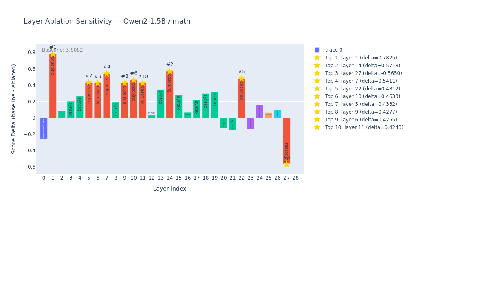
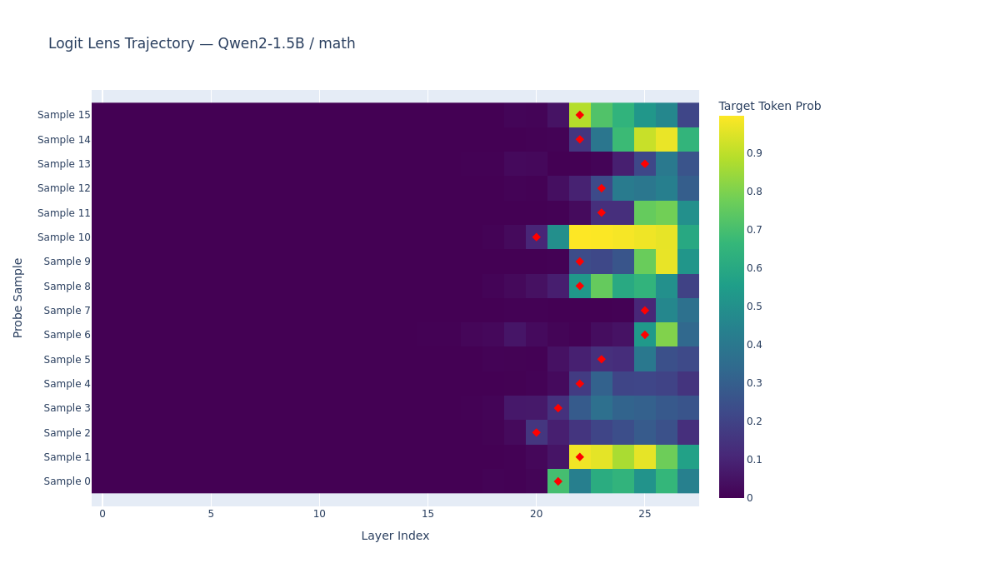

# neuro-scan

[](https://pypi.org/project/neuro-scan/)
[](https://github.com/XXO47OXX/neuro-scan/actions/workflows/ci.yml)

LLM Neuroanatomy Explorer — map what each transformer layer does.

Companion to [layer-scan](https://github.com/XXO47OXX/layer-scan): understand your model's layers before you duplicate them.

### Ablation Sensitivity



### Logit Lens Trajectory



## Features

- **Layer Ablation** — zero out each layer, measure score impact
- **Logit Lens** — project hidden states to vocabulary space
- **Tuned Lens** — per-layer affine probes (Belrose 2023)
- **Attention Entropy** — measure head focus/diffusion
- **Circuit Detection** — find synergistic/redundant layer pairs
- **Block Influence** — single-pass importance estimation (ShortGPT)
- **Cross-probe Analysis** — universal vs task-specific layers
- **Auto Layer Labeling** — classify layers as reasoning/syntax/output/etc
- **Interactive HTML Charts** — Plotly visualizations

## Install

```bash
pipx install neuro-scan
# or
pip install neuro-scan
```

## Quick Start

```bash
# Full neuroanatomy map
neuro-scan map --model <path-or-hf-id> --probe math

# Individual analyses
neuro-scan ablate --model <path> --probe math
neuro-scan logit-lens --model <path> --probe math
neuro-scan attention --model <path> --probe math

# Circuit detection
neuro-scan circuit --model <path> --probe math --strategy fast

# Cross-probe
neuro-scan cross-probe --model <path> --probes "math,eq,json"

# Tuned lens
neuro-scan calibrate --model <path> --output lens.safetensors
neuro-scan logit-lens --model <path> --tuned-lens lens.safetensors

# Fetch pre-computed results (no GPU)
neuro-scan fetch --model Qwen/Qwen2-7B --probe math
```

## Commands

| Command | Description |
|---------|-------------|
| `map` | Full neuroanatomy (ablation + logit lens + attention + labeling) |
| `ablate` | Layer ablation sensitivity scan |
| `logit-lens` | Logit lens trajectory |
| `attention` | Attention entropy analysis |
| `circuit` | Detect synergistic/redundant layer pairs |
| `cross-probe` | Compare importance across probes |
| `compare` | Compare neuroanatomy across models |
| `calibrate` | Train tuned lens probes |
| `fetch` | Download pre-computed reports from HF Hub |
| `prompt-repeat` | Prompt repetition experiment |
| `probes` | List available probes |

## Probes

| Probe | Samples | Tests |
|-------|---------|-------|
| `math` | 16 | Arithmetic, geometry, calculus |
| `eq` | 12 | Emotions, social cues, sarcasm |
| `json` | 10 | JSON extraction, schema compliance |
| `custom` | user-defined | Load from JSON file |

## Backends

| Backend | Quantization | Attention |
|---------|-------------|-----------|
| `transformers` | No | Full support |
| `exllamav2` | GPTQ/EXL2 | Not supported |

## References

- [Tuned Lens (Belrose 2023)](https://arxiv.org/abs/2303.08112)
- [ShortGPT (ACL 2025)](https://arxiv.org/abs/2403.03853)
- [Repeat Yourself: Layer Duplication](https://arxiv.org/abs/2502.01470)

## License

MIT
